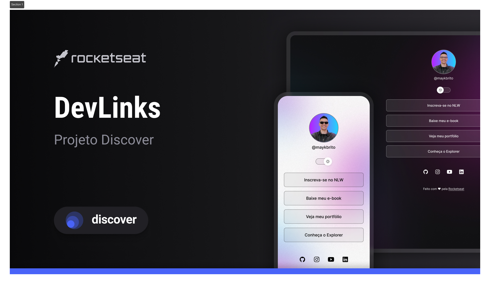

<h1 align= "center"> DevLinks </h1>

 Programa exclusivo e gratuito, promovido pela Rocketseat para ensino de tecnologias WEB.
 

 

  <a href= "#-tecnologias">Tecnologias</a>&nbsp;&nbsp;&nbsp;|&nbsp;&nbsp;&nbsp;
  <a href= "#-projeto">Projeto</a>&nbsp;&nbsp;&nbsp;|&nbsp;&nbsp;&nbsp;
  <a href= "#-layout">Layout</a>&nbsp;&nbsp;&nbsp;|&nbsp;&nbsp;&nbsp;
   <a href= "#memo-licença">Licença</a>
   

   

    
    

   

    

## Tecnologias

-HTML e CSS
-JavaScript
-Git e Github
-Figma

## Projeto

DevLinks é um agreagdor de links para usar como cartão de visitas online.

## Layout

Você pode visualizar o layout do projeto através [DESSE LINK](<https://www.figma.com/design/HxI8ggVzrCVNmbYPCwyFff/DevLinks-•-Projeto-Discover-(Community)?node-id=1603-3&t=ZdeiFKbaMkokrvdA-0>). É necessário ter conta no [Figma](https://figma.com) para acessá-lo.

## Licensa

Este projeto está sob licensa MIT.

---

Feito com carinho pela Rocketseat :wave: [Participe da comunidade](https://discord.gg/rocketseat)
